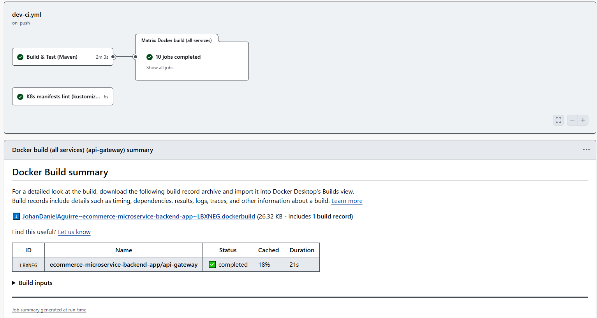
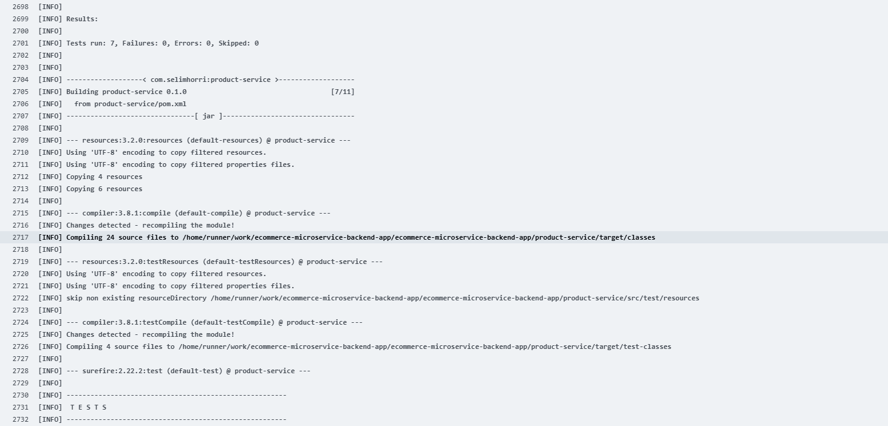
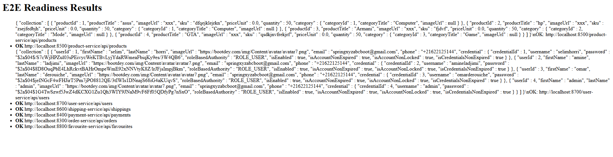
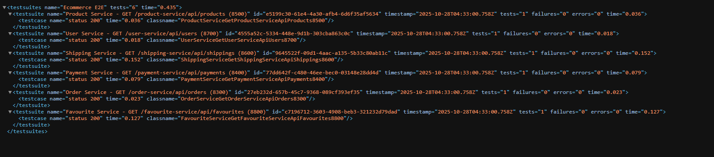
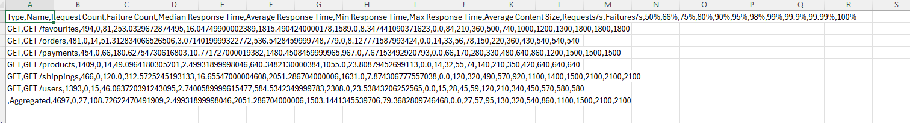
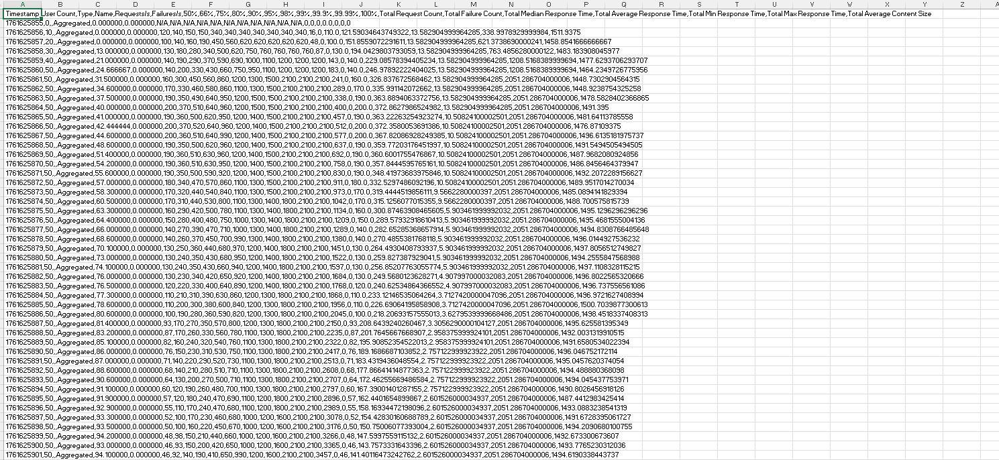
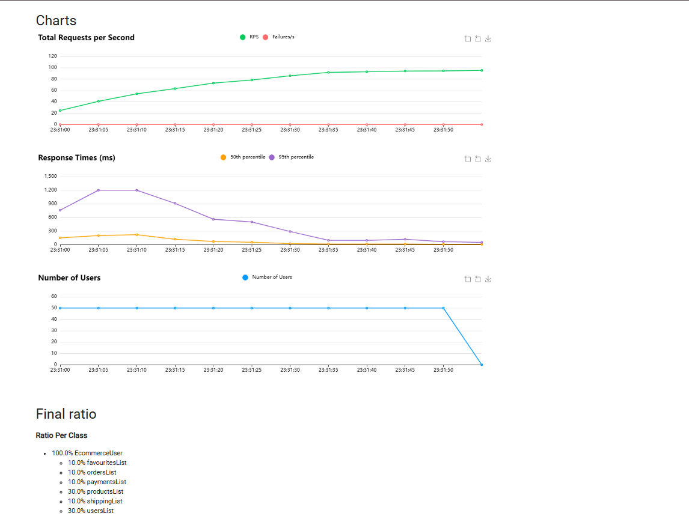

# Reporte completo de cambios y configuración

Fecha: 2025-11-03
Repositorio: ecommerce-microservice-backend-app

Este informe consolida el estado actual y los cambios efectivos en el repositorio por áreas: Kubernetes, Terraform, Ansible, CI/CD (pipelines y reportes), pruebas unitarias e integración, E2E (Postman), carga (Locust), Dockerfiles y Docker Compose. Donde no se dispone de historial Git local, el reporte se basa en los archivos presentes y en la documentación incluida en `Docs/`.

Importante sobre CI/CD y GitHub Pages en `dev`:
- Hoy existen workflows en `.github/workflows/` y están descritos abajo. La documentación (`Docs/DEV-CI-E2E.md` y `Docs/REPORTE-CI-E2E-LOCUST.md`) amplía el diseño.
- Nota de `dev`: está configurado para NO publicar a Pages por reglas del entorno; aun así, los workflows generan artifacts. Si se quiere volver a publicar desde `dev`, hay que ajustar la política del entorno y/o el job de Pages para esa rama.

---

## 1) Resumen ejecutivo

- Se homogenizó la configuración de los microservicios en Kubernetes: Eureka apunta a `service-discovery`, se prioriza registrar por IP del Pod y se desactiva Cloud Config remoto vía env.
- Se exponen Services como NodePort manteniendo puertos “clásicos” para pruebas locales/k3s.
- Ansible automatiza una VM de CI: Docker + Compose, SonarQube + Postgres, Nginx reverse proxy (Sonar bajo `/sonar` y Locust en `8089`), K3s y Helm; además, herramientas de seguridad (Trivy) y healthchecks robustos.
- Terraform (Azure) crea RG, VNet/Subnet, NSG con reglas para 22/80/443/9000/8089/6443 y VMs Ubuntu 20.04 para los nombres provistos en `servers`; expone `public_ips` y `vm_ids` por servidor.
- Pruebas: unitarias e integración presentes por servicio (Spring Boot). E2E con Postman sobre puertos de host (mapeados desde NodePort). Carga con Locust (peso en `/products` y `/users`).
- CI/CD: existen 4 workflows en `.github/workflows`: `ci-all-pages.yml`, `dev-ci.yml`, `dev-e2e.yml`, `locust-e2e.yml`. El combinado puede desplegar a Pages (según reglas del entorno); en `dev`, por política, se están publicando como artifacts.

---

## 2) Kubernetes (carpeta `k8s/`)

- Recursos declarados en `k8s/kustomization.yaml`:
  - `namespace.yaml`, `zipkin.yaml`, `service-discovery.yaml`, `cloud-config.yaml`.
  - Microservicios: `api-gateway.yaml`, `proxy-client.yaml`, `order-service.yaml`, `payment-service.yaml`, `product-service.yaml`, `shipping-service.yaml`, `user-service.yaml`, `favourite-service.yaml`.
- Namespace: `ecommerce`.
- Zipkin:
  - Imagen `openzipkin/zipkin:2.24`, Deployment + Service (ClusterIP puerto 9411).
- Eureka (service-discovery):
  - Imagen `selimhorri/service-discovery-ecommerce-boot:0.1.0`.
  - Configuración como servidor standalone (no se registra ni busca). Prefer IP del Pod.
  - Service ClusterIP puerto 8761.
- Cloud Config (`cloud-config.yaml`):
  - Imagen `selimhorri/cloud-config-ecommerce-boot:0.1.0`.
  - `SPRING_CLOUD_CONFIG_SERVER_GIT_CLONE_ON_START=false`.
  - `EUREKA_CLIENT_SERVICEURL_DEFAULTZONE=http://service-discovery:8761/eureka/`.
- API Gateway (`api-gateway.yaml`):
  - Imagen `selimhorri/api-gateway-ecommerce-boot:0.1.0`.
  - Rutas estáticas por `SPRING_APPLICATION_JSON` (descubrimiento por locator deshabilitado) y regla especial `/app/** → PRODUCT-SERVICE` con `StripPrefix`/`PrefixPath`.
  - Service NodePort en `30080`.
- Microservicios (user, product, order, payment, shipping, favourite):
  - Imágenes `selimhorri/<service>-ecommerce-boot:0.1.0`.
  - Común:
    - `SPRING_PROFILES_ACTIVE=dev`, `SPRING_ZIPKIN_BASE_URL=http://zipkin:9411`.
    - Cloud Config remoto desactivado (y precedencia de ENV sobre config remota) para simplificar despliegue.
    - Eureka `defaultZone` forzado a `http://service-discovery:8761/eureka/`.
    - Registrar por IP del Pod (`EUREKA_INSTANCE_PREFER_IP_ADDRESS=true`, y `EUREKA_INSTANCE_IP_ADDRESS/HOSTNAME` de `status.podIP`).
    - `SPRING_JPA_HIBERNATE_DDL_AUTO=update`.
  - Services tipo NodePort:
    - order: 30300 → 8300
    - payment: 30400 → 8400
    - product: 30500 → 8500
    - shipping: 30600 → 8600
    - user: 30700 → 8700
    - favourite: 30800 → 8800

Imagen de montado (en actions):


Observaciones/mejoras:
- Añadir liveness/readiness probes en todos los Deployments para robustez.
- Definir requests/limits y políticas de reinicio.
- Fijar versiones de imágenes (tags inmutables) y firmar contenedores si aplica.

---

## 3) Terraform (carpeta `infra/`)

- Proveedor AzureRM `~> 3.0` (terraform `>= 1.0.0`).
- `main.tf` crea:
  - Resource Group `${var.prefix_name}-rg` en `var.region`.
  - Virtual Network `10.0.0.0/16` y Subnet `10.0.1.0/24`.
  - Módulo `modules/vm` con:
    - `servers` (set de strings de servidores), size override `Standard_B1ms`.
    - Parámetros: RG, location, subnet, `prefix_name`, `user`, `password`.
- Módulo `modules/vm`:
  - `azurerm_public_ip` y `azurerm_network_interface` por servidor.
  - NSG `${prefix}-sg` con reglas inbound:
    - SSH 22, HTTP 80, HTTPS 443, Sonar 9000, Locust 8089, K8s API 6443.
  - Asociación NIC↔NSG.
  - Linux VM Ubuntu 20.04 (Canonical `20_04-lts-gen2`) con password auth habilitado.
  - Outputs: `public_ips` (k→IP) y `vm_ids` (k→ID).
- Variables: `region`, `prefix_name`, `user`, `password`, `servers`.

Observaciones/mejoras:
- Seguridad:
  - Evitar `password` en texto claro. Usar variables sensibles (TF Cloud/Vars) o Azure Key Vault.
  - Limitar origen en reglas 22/6443 (whitelist por IP) o bastionar.
  - Usar SSH keys y `disable_password_authentication=true` si es viable.

---

## 4) Ansible (carpeta `Ansible/`)

- `inventory.ini` (contiene IPs y credenciales; riesgo: en claro). Recomendado: Ansible Vault o variables protegidas.
- `ansible.cfg`: `host_key_checking=False` (comodidad vs seguridad).
- `playbook.yml`:
  - Play 1 (host `nginx`): instala Nginx, coloca `nginx-base.conf` (incluye `sites-enabled`), despliega reverse proxy (`nginx.conf.j2`):
    - Sonar bajo `/sonar/` con cabeceras `X-Forwarded-*`.
    - Locust expuesto en `8089`.
    - UFW opcional (abre 22/80/8089 y habilita si `enable_ufw=true`).
  - Play 2 (host `CI`): Docker + Compose v2, `vm.max_map_count`, gestión de swap (crear/redimensionar y persistir), copia archivos (compose, nginx.conf, carpeta locust), setea `sonar.web.context=/sonar` en volumen, limpieza de stack anterior, arranque por fases (db → sonarqube con healthcheck); levanta Locust master/worker y Nginx; instala Trivy CLI y contenedor (profile `tools`), instala K3s y Helm 3. UFW opcional para 8089.
- `docker-compose.yml` (para VM de CI):
  - Postgres 11 (PGDATA en subruta), SonarQube 8.2 (healthchecks robustos y contexto `/sonar`), Nginx, Locust master/worker (2.29.1), Trivy, K3s v1.29.5.
  - Mapeos de puertos del host a NodePorts del cluster (8080→30080, 8300→30300, etc.).
- Plantillas Nginx:
  - `nginx-base.conf.j2`: conf base + include `conf.d` y `sites-enabled`.
  - `nginx.conf.j2`: reverse proxy a Sonar y Locust, detectando dinámicamente el host del grupo CI.

Observaciones/mejoras:
- Proteger inventario con Vault; considerar HTTPS en Nginx.
- Verificar recursos mínimos para Sonar (RAM/`vm.max_map_count`).

---

## 5) Dockerfiles (por servicio)

Patrón común (OpenJDK 11):
- `FROM openjdk:11`, `ARG PROJECT_VERSION=0.1.0`, copia del módulo y `ADD .../target/<name>-v${PROJECT_VERSION}.jar`.
- `EXPOSE <puerto>` y `ENTRYPOINT` ejecutando el JAR con `-Dspring.profiles.active` (excepto `cloud-config` que no fija perfil por env en el ENTRYPOINT).

Observaciones/mejoras:
- Considerar multi-stage builds y runtime más liviano (JRE Temurin/distroless), y usuario no-root.
- Fijar versiones de base images y/o escanear con Trivy en CI.

---

## 6) Docker Compose (raíz)

- `core.yml`: Zipkin, Service Discovery y Cloud Config con `SPRING_PROFILES_ACTIVE=dev` y dependencias mínimas.
- `compose.yml`: microservicios completos con env para Zipkin, Cloud Config y Eureka; mapeos de puertos a host (8080, 8300, 8400, 8500, 8600, 8700, 8800, 8900).
- `compose.stage.yml` y `core.stage.yml`: sobreescriben `SPRING_PROFILES_ACTIVE=stage` y mantienen el resto.

Observaciones:
- Útil para desarrollo/stage local; producción apunta a Kubernetes.

---

## 7) Pruebas unitarias e integración (`**/src/test/`)

- Por servicio existen suites con patrón Spring Boot:
  - Unitarias tipo `@WebMvcTest`: `ProductResourceWebMvcTest`, `UserResourceWebMvcTest`, `OrderItemResourceWebMvcTest`, `PaymentResourceWebMvcTest`, `OrderResourceWebMvcTest`, `FavouriteResourceWebMvcTest`.
  - Integración tipo `@SpringBootTest` + `@AutoConfigureMockMvc`: `*IntegrationTests` para los mismos.
  - En varios módulos hay `*AdditionalWebMvcTests`.
- Recomendado: añadir Jacoco y publicar cobertura en artifacts/Pages.

Imagen de reporte:



---

## 8) E2E con Postman (`tests/postman/`)

- Colección `ecommerce-e2e.postman_collection.json` con 6 requests `GET`:
  - `http://localhost:8500/product-service/api/products`
  - `http://localhost:8700/user-service/api/users`
  - `http://localhost:8600/shipping-service/api/shippings`
  - `http://localhost:8400/payment-service/api/payments`
  - `http://localhost:8300/order-service/api/orders`
  - `http://localhost:8800/favourite-service/api/favourites`
- Cada request valida `status 200`.
- Mejora: añadir casos contra el API Gateway (8080) además de endpoints directos.

Imagen de reporte:



---

## 9) Pruebas de carga con Locust (`tests/locust/`)

- `locustfile.py`:
  - Parámetros por env y, por defecto, usa NodePorts del cluster para `products/users/shippings/payments/orders/favourites`.
  - Ponderación: foco en `/products` y `/users` (3x), resto smoke (1x) con `try/except` para no fallar si un servicio no responde.
  - `wait_time` entre 0.25 y 0.75s.
- `requirements.txt`: `locust==2.31.3`.
- Ejecutable en modo headless con HTML/CSV (según pipelines descritos en Docs).

Imagenes pruebas en locust:







---

## 10) Pipelines CI/CD y reportes (Workflows)

Workflows presentes en `.github/workflows`:

1. `ci-all-pages.yml` (CI + E2E + Locust + Pages)
   - Triggers: `push`, `pull_request` y `workflow_dispatch` en `main`, `master` y `dev`.
   - Jobs:
     - `build-and-test`: ejecuta `./mvnw test`, recopila surefire en `site/unit-integration` y sube artifact parcial `site-unit-integration`.
     - `e2e-and-locust` (kind): aplica `k8s/`, espera rollouts/endpoints, hace port-forward a pods, genera `site/e2e/index.html` (readiness), corre Locust en modo headless (HTML/CSV a `site/locust`) y sube `site` con `actions/upload-pages-artifact`.
     - `deploy-pages`: publica `site/` a GitHub Pages (`actions/deploy-pages`).
   - Nota: Se corrigió un 404 tras el deploy agregando en `e2e-and-locust` la descarga/merge del artifact `site-unit-integration` al directorio `site` y pasos que aseguran `site/index.html` y `site/404.html` antes de subir el artifact de Pages. Si las reglas de entorno bloquean `dev`, el contenido queda como artifact para descarga.

2. `dev-ci.yml` (CI en rama `dev`)
   - Triggers: `push`, `pull_request` y `workflow_dispatch` en `dev`.
   - Jobs:
     - `build-java`: build+tests Maven y publicación de `surefire-reports` como artifact.
     - `docker-build`: build de imágenes de todos los servicios (sin push) con Buildx y caché.
     - `k8s-lint`: `kustomize build` → `k8s-rendered.yaml` y validación `kubeconform`; sube artifact `k8s-rendered`.

3. `dev-e2e.yml` (E2E con Newman en kind; rama `dev`)
   - Triggers: `push`, `pull_request` y `workflow_dispatch` en `dev`.
   - Jobs:
     - `unit-integration`: `mvn test` (deshabilita eureka/config), publica `surefire-reports`.
     - `e2e`: crea cluster kind, aplica `k8s` con `kubectl apply -k`, espera Deployments/Pods Ready, port-forward a pods, warm-up con retries, ejecuta Newman y sube `newman-results.xml` como artifact.

4. `locust-e2e.yml` (E2E de carga con Locust en kind; rama `dev`)
   - Triggers: `push`, `pull_request` y `workflow_dispatch` en `dev`.
   - Job `e2e-locust`:
     - Instala Python/Locust, crea cluster kind, `kubectl apply -k k8s`, espera Ready, port-forward a pods, warm-up (retries), ejecuta Locust en `--headless` (1m, u=50, r=10), y sube artifacts: `locust-report.html` y `locust-results*.csv`.

Recomendaciones de configuración:
- Si deseas publicar Pages también desde `dev`, revisa Settings > Pages (entorno `github-pages`) y ajusta las reglas para permitir deploy desde `dev` o limita triggers a `main`/`master` si quieres mantener la política actual.
- En Branch Protection, marca como checks requeridos los jobs relevantes de estos workflows.

---

## 11) Riesgos y mejoras recomendadas

Seguridad:
- `inventory.ini` contiene credenciales en claro (redactado en este reporte). Usar Ansible Vault / secrets.
- Restringir puertos sensibles (22/6443) por IP en el NSG o usar bastion.
- Imágenes Docker ejecutan como root; ideal usar usuario no-root y reducir superficie (distroless/JRE).

Disponibilidad/robustez:
- Añadir probes liveness/readiness y recursos (requests/limits) en Deployments.
- Healthchecks ya sólidos en Sonar/Postgres; replicar patrón en otros.

Calidad/CI:
- Añadir Jacoco, y publicar cobertura como artifact/Pages.
- Complementar E2E hacia API Gateway además de servicios directos.
- Restaurar workflows YAML conforme a Docs y a la política de Pages en `dev`/`main`.

---

## 12) Anexos rápidos

Listado de Services NodePort (Kubernetes):
- api-gateway: 30080 → 8080
- order-service: 30300 → 8300
- payment-service: 30400 → 8400
- product-service: 30500 → 8500
- shipping-service: 30600 → 8600
- user-service: 30700 → 8700
- favourite-service: 30800 → 8800

Recursos Terraform principales:
- RG, VNet `10.0.0.0/16`, Subnet `10.0.1.0/24`.
- NSG (SSH 22, HTTP 80, HTTPS 443, Sonar 9000, Locust 8089, K8s API 6443).
- VMs Ubuntu 20.04, IPs públicas por servidor; outputs `public_ips` y `vm_ids`.

---

## 13) Cobertura de requerimientos

- Kubernetes: OK (manifiestos y configuración detallada).
- Terraform: OK (proveedor, recursos, módulo VM y reglas NSG).
- Ansible: OK (plays, reverse proxy, compose, K3s, Trivy, healthchecks, swap).
- Pipelines/CI: OK (4 workflows presentes y descritos; publicación a Pages condicionada por reglas de entorno en `dev`).
- Pruebas unitarias: OK (presencia por servicio y patrón descrito).
- E2E (Postman): OK (colección y endpoints).
- Locust: OK (script y escenarios).
- Dockerfiles: OK (patrón y mejoras sugeridas).
- Docker Compose: OK (core/compose y stage overrides).

---

## 14) Pasos siguientes (opcional)

1) Restaurar workflows de Actions:
   - Combinado (CI + E2E + Locust + Pages) y/o `dev-ci.yml` + `dev-e2e.yml` según `Docs/`.
   - Si quieres publicar Pages también desde `dev`, habilitar el job `deploy-pages` y ajustar reglas de entorno.
2) Añadir probes y recursos en K8s; integrar Jacoco a los builds.
3) Endurecer seguridad: Vault para inventario Ansible, SSH keys en Terraform, limitar NSG.
4) Optimizar contenedores: multi-stage y usuario no-root; escanear con Trivy en CI.

---

## 15) Cómo reproducir rápidamente E2E/Locust (local)

- E2E Postman (con k3s de `Ansible/docker-compose.yml` y NodePorts abiertos):

```bat
npm i -g newman
newman run tests\postman\ecommerce-e2e.postman_collection.json
```

- Locust headless (NodePorts activos):

```bat
python -m venv .venv
.venv\Scripts\activate
pip install -r tests\locust\requirements.txt
locust -f tests\locust\locustfile.py --headless -u 20 -r 5 -t 1m --html locust-report.html --csv locust-results
```

---

Fin del reporte.
